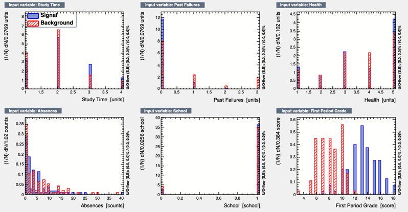
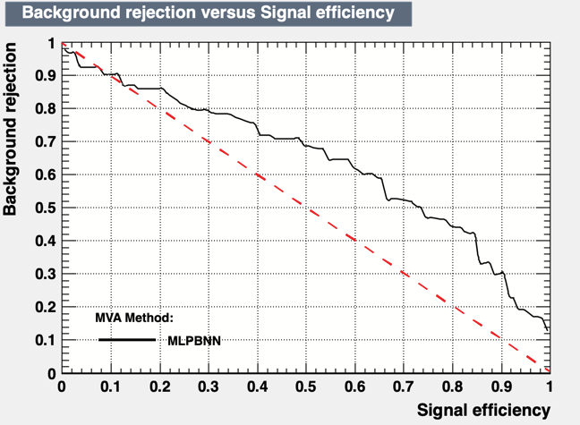
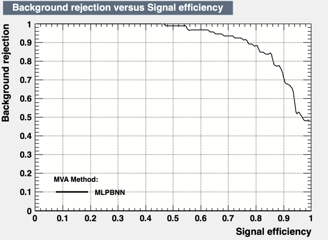

# Methods

I took [this dataset](https://archive.ics.uci.edu/ml/datasets/student+performance) and parsed the csv file so it could be read by Root.

If G3 >= 10.8, the grade was passing. Passing grades were signal events while failing grades were background.

## Input variables

### Study Time:

<ul>
    <li>1: Less than 2 hours</li>
    <li>2: 2 - 5 hours</li>
    <li>3: 5 - 10 hours</li>
    <li>4: More than 10 hours</li>
</ul>

### Failures: 

<ul>
    <li>n if 1 ≤ n < 3, else 4</li>
</ul>

### Health: 

<ul>
    <li>1: Very Bad</li>
    <li>2: Bad</li>
    <li>3: Ok</li>
    <li>4: Good</li>
    <li>5: Very Good</li>
</ul>

### Absences: 

<ul>
    <li>0 - 93</li>
</ul>

### School: 

<ul>
    <li>0: Mousinho da Silveira</li>
    <li>1: Gabriel Pereira</li>
</ul>

### G1:

<ul>
    <li>0 - 20</li>
</ul>

# Results

#### Results Without G1

<em>The red-dashed line represents the ROC curve of a random classifier.
The classifier is slightly better than random</em>

#### Results With G1

